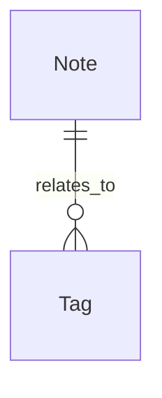

# Data Model

Application entity, local-storage, and settings contracts.

## Entities & Local Records

### Note

A single note

| Field | Type | Required | Notes |
| --- | --- | --- | --- |
| id | uuid | Yes | _—_ |
| title | text | Yes | _—_ |
| body | markdown | No | _—_ |

### Tag

| Field | Type | Required | Notes |
| --- | --- | --- | --- |
| label | text | Yes | unique |

## Relationships
- Note has many Tag

## ER Diagram

## Data Rules
- Validate all external input at the boundary.
- Do not invent schemas, payloads, variables, outputs, config shapes, or persisted state.
- Update this file before changing a schema or data contract.
- Record schema decisions in the Decision Log of `progress-tracker.md`.
