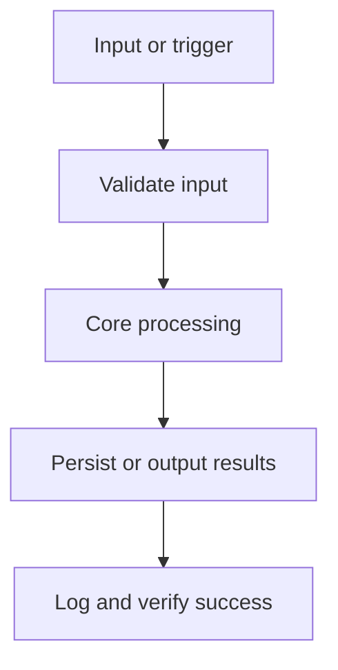

# Architecture

System architecture and technical structure for Notesmith.

## Overview
Notesmith is a desktop application. Local-first note manager with fast search.

Data contracts live in `data-model.md`; do not persist, parse, expose, or output data shapes that are not documented there.

## Stack Summary

| Layer | Choice |
| --- | --- |
| Frontend | _None selected - open decision_ |
| Database | _None selected - open decision_ |
| ORM / DB Access | _None selected - open decision_ |
| Validation | _None selected - open decision_ |
| Testing | _None selected - open decision_ |
| Deployment | _None selected - open decision_ |

## Architecture Evidence & Diagrams



System boundaries: everything in this repository is inside the boundary; the operating system, external services, and the update/distribution channel are outside. Confirm before adding any integration that crosses it.

## Data Flow
1. The user interacts with the UI (HTML/CSS with React, Vue, or plain DOM in the renderer).
2. UI events reach core logic through the framework boundary: renderer → contextBridge (preload) → ipcMain handler in the main process.
3. Inputs crossing that boundary are validated — treat them as untrusted.
4. MVP feature flow: 1. Create and edit notes → 2. Full-text search → 3. Tagging.
5. Data is persisted locally via app.getPath('userData') — JSON settings, SQLite (better-sqlite3), or electron-store.
6. Results update application state and the UI re-renders; long work runs off the UI thread.

## Folder Structure Recommendation

```text
src/main/         # main process: windows, IPC handlers, app lifecycle
src/preload/      # contextBridge API surface (narrow, validated)
src/renderer/     # UI (web tech) — no Node access
src/shared/       # types + IPC contracts shared across processes
assets/           # icons, installer resources
forge.config.ts   # or electron-builder.yml
package.json
```

## Key Implementation Notes
- Validation approach: validate all external input at the boundary; choose the validation tooling in Phase 0.
- Constraint: Offline-first
- Constraint: No telemetry

## Configuration

| Name | Required | Source | Default | Visibility | Used By | Notes |
| --- | --- | --- | --- | --- | --- | --- |
| Settings / data location | Yes | OS app-data directory | _None_ | internal | Persistence layer | Define the settings schema before writing it. |
| Packaging targets | Yes | Build pipeline | _None_ | internal | Release process | _—_ |
| Code signing | Yes | CI secrets / certificate store | _None_ | secret | Installers and updates | Signing certificates are secrets; never commit them. |
| Auto-update channel | No | Update server / store | _None_ | internal | Updater | Updates must be signed and served over HTTPS. |

Rules:
- Read configuration only from the sources listed here.
- Treat every value marked secret as sensitive: never commit, print, or expose it.
- Update this table before adding a new environment variable, config file key, flag, tfvar, or scheduler setting.

## Security Considerations
- Keep `contextIsolation: true`, `nodeIntegration: false`, `sandbox: true` (Electron 20+ defaults) — never relax them.
- Expose one narrow method per IPC message via `contextBridge`; never expose raw `ipcRenderer`.
- Validate every IPC payload in the main process like an untrusted HTTP request.
- Set a restrictive Content-Security-Policy and block navigation/window.open to unknown origins.
- Never load remote code; keep Electron updated to pick up Chromium/V8 security fixes.
- Code-sign installers and serve auto-updates over HTTPS with signature verification.
- Store local data in the OS app-data directory; never in the install directory.
- Never commit secrets; load them from the environment or a secrets manager.
- Keep dependencies pinned; update them deliberately, not implicitly.

## Packaging & Operations
- Build: Electron Forge (official) or electron-builder
- Packaging: electron-builder / Forge makers — NSIS or MSI (Windows), dmg (macOS), AppImage/deb (Linux)
- Code signing: _TBD — required for distribution on every OS._
- Auto-update: electron-updater or Squirrel via update server / GitHub releases
- Distribution: Website download, GitHub releases, Microsoft Store, winget
- Target OS: _TBD — define before the first release build._
- CI builds, signs, and verifies installers for every target OS; a release is the full set of signed artifacts.
- Capture crash reports (e.g. Sentry or framework-native reporting) before public release.

## Known Issues / Tech Debt

| Item | Impact | Planned Resolution |
| --- | --- | --- |
| _None recorded yet_ | _—_ | _Update this table during implementation._ |
