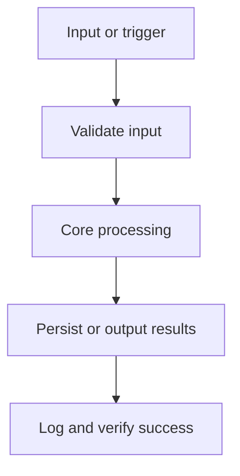

# Build Plan

Phased implementation plan derived from the MVP scope.

## Build Objective
Local-first note manager with fast search.

## Context Preparation (Before Coding)
- [ ] Read the minimum required files per the Context Usage Strategy in `project-overview.md`
- [ ] Confirm open decisions listed in `project-overview.md` or ask before proceeding

## Flow

## MVP Features
- Create and edit notes — Markdown editor with autosave
- Full-text search — Indexed, under 100ms
- Tagging

## Implementation Phases

### Phase 0: Project Setup
- [ ] Scaffold the folder structure from `architecture.md`
- [ ] Install approved dependencies from `library-docs.md`
- [ ] Confirm `data-model.md` (entity or local record contracts) or explicitly defer with a tracker decision
- [ ] Confirm `architecture.md` -> `Configuration` or explicitly defer with a tracker decision
- [ ] Choose Frontend for this Desktop Application.
- [ ] Choose Database for this Desktop Application.
- [ ] Choose ORM / DB Access for this Desktop Application.
- [ ] Choose Validation for this Desktop Application.
- [ ] Choose Testing for this Desktop Application.
- [ ] Choose Deployment for this Desktop Application.
- [ ] Configure lint, typecheck, and test tooling so every verification command runs
- [ ] Commit a walking skeleton: the project runs end-to-end with no real features yet

### Phase 1: Create and edit notes
_Markdown editor with autosave_

- [ ] Implement
- [ ] Validate inputs
- [ ] Test
- [ ] Verify against definition of done
- [ ] Update `progress-tracker.md`

### Phase 2: Full-text search
_Indexed, under 100ms_

- [ ] Implement
- [ ] Validate inputs
- [ ] Test
- [ ] Verify against definition of done
- [ ] Update `progress-tracker.md`

### Phase 3: Tagging
- [ ] Implement
- [ ] Validate inputs
- [ ] Test
- [ ] Verify against definition of done
- [ ] Update `progress-tracker.md`

### Phase 4: Hardening & Release Readiness
- [ ] Review against Security Considerations in `architecture.md`
- [ ] Complete the Testing Checklist below
- [ ] Update docs: README, usage/runbook
- [ ] Final pass on `progress-tracker.md`: statuses, decision log, change log

## Acceptance Criteria
- [ ] Search under 100ms on 10k notes.

Definition of done: The app builds with CMake and runs on all target OSes, delivering the MVP. Core logic is covered by ctest units. UI stays responsive under load. Deployment bundles are produced with windeployqt/macdeployqt.

## Testing Checklist
- [ ] Create and edit notes — happy path and failure path covered
- [ ] Full-text search — happy path and failure path covered
- [ ] Tagging — happy path and failure path covered
- [ ] `cmake --build build` passes
- [ ] `ctest --test-dir build` passes
- [ ] `clang-format --dry-run --Werror src/*.cpp` passes
- [ ] `clang-tidy -p build src/*.cpp` passes

## Risks & Mitigations

| Risk | Likelihood | Mitigation |
| --- | --- | --- |
| Search index growth | _TBD_ | cap and compact periodically |
