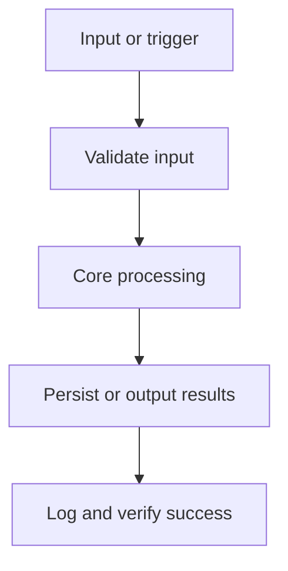

# Architecture

System architecture and technical structure for Notesmith.

## Overview
Notesmith is a desktop application. Local-first note manager with fast search.

Data contracts live in `data-model.md`; do not persist, parse, expose, or output data shapes that are not documented there.

## Stack Summary

| Layer | Choice |
| --- | --- |
| Frontend | _None selected - open decision_ |
| Database | _None selected - open decision_ |
| ORM / DB Access | _None selected - open decision_ |
| Validation | _None selected - open decision_ |
| Testing | _None selected - open decision_ |
| Deployment | _None selected - open decision_ |

## Architecture Evidence & Diagrams



System boundaries: everything in this repository is inside the boundary; the operating system, external services, and the update/distribution channel are outside. Confirm before adding any integration that crosses it.

## Data Flow
1. The user interacts with the UI (Any static web frontend — React/Vite, Next.js with output: 'export', Svelte).
2. UI events reach core logic through the framework boundary: WebView UI → invoke() → #[tauri::command] function in Rust.
3. Inputs crossing that boundary are validated — treat them as untrusted.
4. MVP feature flow: 1. Create and edit notes → 2. Full-text search → 3. Tagging.
5. Data is persisted locally via SQLite in app data.
6. Results update application state and the UI re-renders; long work runs off the UI thread.

## Folder Structure Recommendation

```text
src/                     # web frontend (static build)
src-tauri/src/           # Rust: commands, state, plugins
src-tauri/capabilities/  # permission grants per window (keep minimal)
src-tauri/tauri.conf.json
src-tauri/Cargo.toml
package.json
```

## Key Implementation Notes
- Validation approach: validate all external input at the boundary; choose the validation tooling in Phase 0.
- Constraint: Offline-first
- Constraint: No telemetry

## Configuration

| Name | Required | Source | Default | Visibility | Used By | Notes |
| --- | --- | --- | --- | --- | --- | --- |
| Settings / data location | Yes | OS app-data directory | SQLite in app data | internal | Persistence layer | Define the settings schema before writing it. |
| Packaging targets | Yes | Build pipeline | _None_ | internal | Release process | _—_ |
| Code signing | Yes | CI secrets / certificate store | EV cert (Windows), Developer ID (macOS) | secret | Installers and updates | Signing certificates are secrets; never commit them. |
| Auto-update channel | No | Update server / store | _None_ | internal | Updater | Updates must be signed and served over HTTPS. |

Rules:
- Read configuration only from the sources listed here.
- Treat every value marked secret as sensitive: never commit, print, or expose it.
- Update this table before adding a new environment variable, config file key, flag, tfvar, or scheduler setting.

## Security Considerations
- Grant the minimum capability/permission set in `capabilities/` — never a blanket allowlist.
- Validate every `#[tauri::command]` input at the Rust boundary; return `Result`, never `unwrap` in handlers.
- Set a restrictive CSP in `tauri.conf.json`.
- Keep secrets and privileged work in Rust; the WebView only sees what commands return.
- Sign update manifests (Tauri updater) and installers for each OS.
- Store local data in SQLite in app data; never in the install directory.
- Never commit secrets; load them from the environment or a secrets manager.
- Keep dependencies pinned; update them deliberately, not implicitly.

## Packaging & Operations
- Build: cargo tauri build (frontend built first via beforeBuildCommand)
- Packaging: Tauri bundler — MSI/NSIS (Windows), dmg/app (macOS), AppImage/deb/rpm (Linux)
- Code signing: EV cert (Windows), Developer ID (macOS)
- Auto-update: Tauri updater plugin with signed update manifests
- Distribution: Website download, GitHub releases, winget, app stores
- Target OS: Windows, macOS
- CI builds, signs, and verifies installers for every target OS; a release is the full set of signed artifacts.
- Capture crash reports (e.g. Sentry or framework-native reporting) before public release.

## Known Issues / Tech Debt

| Item | Impact | Planned Resolution |
| --- | --- | --- |
| _None recorded yet_ | _—_ | _Update this table during implementation._ |
