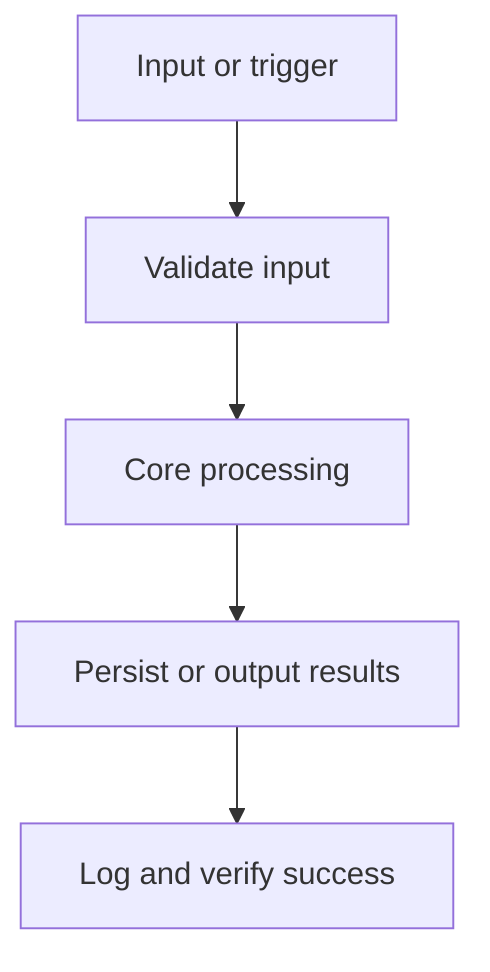

# Architecture

System architecture and technical structure for Notesmith.

## Overview
Notesmith is a full application. Local-first note manager with fast search.

Data contracts live in `data-model.md`; do not persist, parse, expose, or output data shapes that are not documented there.

## Stack Summary

| Layer | Choice |
| --- | --- |
| Frontend | Next.js App Router + TypeScript, Tailwind CSS, shadcn/ui |
| Backend / API | _None selected - open decision_ |
| Database | _None selected - open decision_ |
| ORM / DB Access | _None selected - open decision_ |
| Auth | _None selected - open decision_ |
| Validation | Zod |
| Testing | Vitest, Playwright |
| Deployment | Vercel |

## Architecture Evidence & Diagrams



System boundaries: everything in this repository is inside the boundary; the user's browser, third-party services, and deployment platform are outside. Confirm before adding any integration that crosses it.

## Data Flow
1. User interacts with the UI layer.
2. Requests are validated using Zod.
3. MVP feature flow: 1. Create and edit notes → 2. Full-text search → 3. Tagging.
4. Persistence is handled by the data layer.
5. Results are returned and rendered.

## Folder Structure Recommendation

```text
app/              # routes and pages
components/       # reusable UI components
  ui/             # design-system primitives
lib/              # pure logic, generation, utilities
public/           # static assets
tests/            # unit and e2e tests
```

## Key Implementation Notes
- Authentication approach: _TBD — decide before building protected features._
- Validation approach: validate all external input at the boundary with Zod.
- Constraint: Offline-first
- Constraint: No telemetry

## Configuration

| Name | Required | Source | Default | Visibility | Used By | Notes |
| --- | --- | --- | --- | --- | --- | --- |
| _No configuration variables defined_ | _TBD_ | _TBD_ | _None_ | _TBD_ | _TBD_ | _Add variables in the Stack step or explicitly defer._ |

Rules:
- Read configuration only from the sources listed here.
- Treat every value marked secret as sensitive: never commit, print, or expose it.
- Update this table before adding a new environment variable, config file key, flag, tfvar, or scheduler setting.

## Security Considerations
- Escape/encode all user-supplied content rendered in the UI (XSS).
- Decide the authentication story before building protected features; enforce authorization on the server, never only in the UI.
- If sessions are introduced, use HTTPS-only cookies and standard session hardening.
- Never commit secrets; load them from the environment or a secrets manager.
- Keep dependencies pinned; update them deliberately, not implicitly.

## Deployment & Operations
- Target: Vercel
- Configuration via the Configuration table; never hardcode environment differences.
- The production build must pass locally before deploying.
- Use preview deployments for review when the platform supports them.
- Rollback: document how to restore the last known-good deployment.

## Known Issues / Tech Debt

| Item | Impact | Planned Resolution |
| --- | --- | --- |
| _None recorded yet_ | _—_ | _Update this table during implementation._ |
