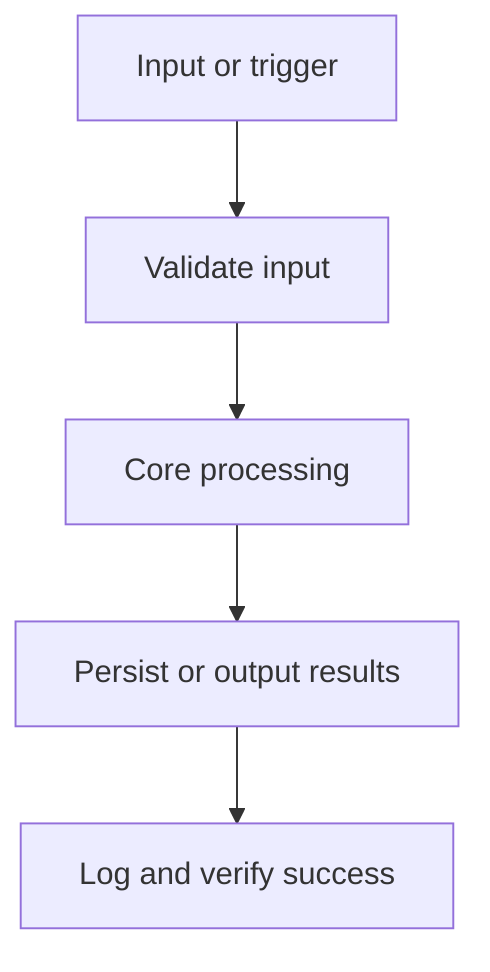

# Architecture

System architecture and technical structure for Notesmith.

## Overview
Notesmith is a Python script. Local-first note manager with fast search.

Data contracts live in `data-model.md`; do not persist, parse, expose, or output data shapes that are not documented there.

## Stack Summary

| Layer | Choice |
| --- | --- |
| Validation | _None selected - open decision_ |
| Testing | _None selected - open decision_ |
| Automation / Scripts | _None selected - open decision_ |

## Architecture Evidence & Diagrams



System boundaries: everything in this repository is inside the boundary; external services, data sources, and the scheduler/invoker are outside. Confirm before adding any integration that crosses it.

## Execution Flow
1. Script is invoked with --input notes.csv.
2. Dependencies are resolved.
3. Input is read from CSV.
4. Processing occurs.
5. Output is written to JSON.
6. Errors are handled via exit codes.
7. Logging goes to stdout.

## Folder Structure Recommendation

```text
src/              # script source (entry point: main.py or equivalent)
config/           # configuration files
tests/            # unit tests
requirements.txt  # pinned dependencies
README.md
```

## Key Implementation Notes
- Validation approach: validate all external input at the boundary; choose the validation tooling in Phase 0.
- Constraint: Offline-first
- Constraint: No telemetry

## Configuration

| Name | Required | Source | Default | Visibility | Used By | Notes |
| --- | --- | --- | --- | --- | --- | --- |
| Arguments / parameters | Yes | Invocation | --input notes.csv | public | Entry point | Validate before use. |
| Config file | No | File system | _None_ | internal | Runtime config | Define defaults and missing-file behavior. |
| Environment variables | No | Environment | _None_ | secret | External integrations | env |
| Logging | Yes | Runtime | stdout | internal | Operations | exit codes |
| Retry behavior | No | Runtime policy | _None_ | internal | External calls | _—_ |

Rules:
- Read configuration only from the sources listed here.
- Treat every value marked secret as sensitive: never commit, print, or expose it.
- Update this table before adding a new environment variable, config file key, flag, tfvar, or scheduler setting.

## Security Considerations
- Load credentials via env; never hardcode them.
- Run with the least privilege required; fail closed on permission errors.
- Never write secrets to logs or temp files; create temp files safely.
- Validate file paths and external input before acting on them.
- Never commit secrets; load them from the environment or a secrets manager.
- Keep dependencies pinned; update them deliberately, not implicitly.

## Deployment & Operations
- Packaging: pip
- Scheduling / trigger: manual
- Monitoring: _TBD — define how failures are noticed._
- Logging destination: stdout
- Write a short runbook in the README: how to run manually and how to safely re-run after a failure.
- Destructive actions need dry-run or confirmation behavior before production use.

## Known Issues / Tech Debt

| Item | Impact | Planned Resolution |
| --- | --- | --- |
| _None recorded yet_ | _—_ | _Update this table during implementation._ |
