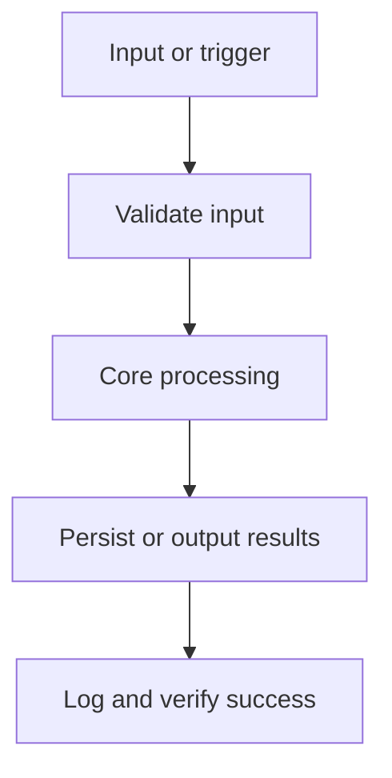

# Build Plan

Phased implementation plan derived from the MVP scope.

## Build Objective
Local-first note manager with fast search.

## Context Preparation (Before Coding)
- [ ] Read the minimum required files per the Context Usage Strategy in `project-overview.md`
- [ ] Confirm open decisions listed in `project-overview.md` or ask before proceeding

## Flow

## MVP Features
- Create and edit notes — Markdown editor with autosave
- Full-text search — Indexed, under 100ms
- Tagging

## Implementation Phases

### Phase 0: Project Setup
- [ ] Scaffold the folder structure from `architecture.md`
- [ ] Install approved dependencies from `library-docs.md`
- [ ] Confirm `data-model.md` (data shape contracts) or explicitly defer with a tracker decision
- [ ] Confirm `architecture.md` -> `Configuration` or explicitly defer with a tracker decision
- [ ] Choose Validation for this Python Script.
- [ ] Choose Testing for this Python Script.
- [ ] Choose Automation / Scripts for this Python Script.
- [ ] Configure lint, typecheck, and test tooling so every verification command runs
- [ ] Commit a walking skeleton: the project runs end-to-end with no real features yet

### Phase 1: Create and edit notes
_Markdown editor with autosave_

- [ ] Implement
- [ ] Validate inputs
- [ ] Test
- [ ] Verify against definition of done
- [ ] Update `progress-tracker.md`

### Phase 2: Full-text search
_Indexed, under 100ms_

- [ ] Implement
- [ ] Validate inputs
- [ ] Test
- [ ] Verify against definition of done
- [ ] Update `progress-tracker.md`

### Phase 3: Tagging
- [ ] Implement
- [ ] Validate inputs
- [ ] Test
- [ ] Verify against definition of done
- [ ] Update `progress-tracker.md`

### Phase 4: Hardening & Release Readiness
- [ ] Review against Security Considerations in `architecture.md`
- [ ] Complete the Testing Checklist below
- [ ] Update docs: README, usage/runbook
- [ ] Final pass on `progress-tracker.md`: statuses, decision log, change log

## Acceptance Criteria
- [ ] Search under 100ms on 10k notes.

Definition of done: Script runs without errors on the target OS. All edge cases are handled with proper error messages. Dependencies are documented. Script passes linting and type checking.

## Testing Checklist
- [ ] Create and edit notes — happy path and failure path covered
- [ ] Full-text search — happy path and failure path covered
- [ ] Tagging — happy path and failure path covered
- [ ] `python -m py_compile main.py` passes
- [ ] `ruff check .` passes
- [ ] `pytest` passes
- [ ] `mypy .` passes

## Risks & Mitigations

| Risk | Likelihood | Mitigation |
| --- | --- | --- |
| Search index growth | _TBD_ | cap and compact periodically |
