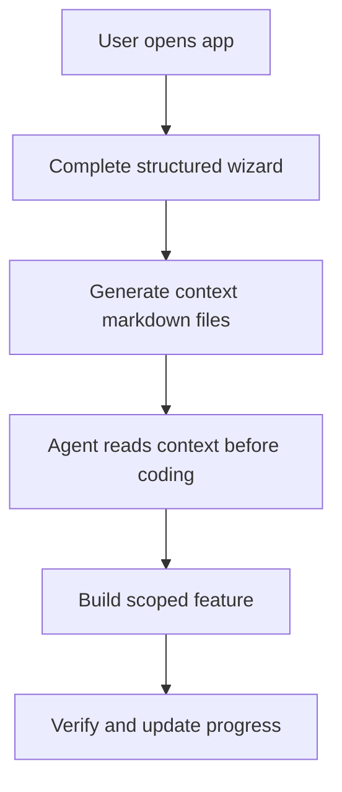

# Prompt — Build Context Editor Web UI Application

You are a senior full-stack product engineer and UI architect. Before writing code, think through the product like an architect: understand the existing brief and reference images, align the language, identify implementation decisions that materially affect the build, then produce a clear implementation plan. This prompt follows the attached `architect` skill style: think alongside the developer, avoid unnecessary interrogation, clarify only decisions that change the implementation, and build only after the blueprint is clear.

## Product Name

**Context Editor**

## Product Concept

Build a **Context Forge-style wizard web application** that turns a structured project brief into **9 AI-ready markdown context files**. The application must not rely on AI calls. Everything must be generated locally from structured form inputs, live editor content, and user-selected design/system choices.

The core goal is to help a developer prepare strong context before coding, so the implementation agent can read the generated markdown files and build with clear scope, standards, architecture, UI rules, library notes, and progress tracking instead of vibe-coding.

## Design Direction

Design the web application using a refined, minimal, highly usable interface influenced by **Jony Ive’s clarity, restraint, material softness, and precision**, with **Dieter Rams-style principles**: useful, understandable, unobtrusive, honest, long-lasting, thorough, and as little design as possible.

The UI should feel calm, precise, useful, restrained, and trustworthy.

Use the visual reference images as the primary layout guide:

- Left fixed sidebar with app logo, app name, numbered wizard steps, active pill highlight, and completed checkmarks.
- Large central content area with generous spacing.
- Rounded input fields and soft borders.
- Minimal blue accent color.
- Sticky bottom navigation bar with Back, Continue / Generate files, and step counter.
- Export screen with file list on the left and markdown preview/editor on the right.
- No visual clutter, no heavy gradients, no unnecessary decoration.

## Required Application Flow Based on Reference Images

The application must implement a 7-step wizard. Each step collects structured inputs and maps them into the generated markdown files.

### Step 1 — Idea

Purpose: Capture the core intent of the project and map it directly to `project-overview.md`.

Fields:

- Project Name
- One-Line Pitch
- Problem Statement
- Target Users
- Success Criteria
- Constraints, one item per line

Reference default example:

- Project Name: Cloud Cost Monitoring Dashboard
- One-Line Pitch: A web dashboard that helps teams monitor daily cloud spending.
- Target Users: Cloud engineers, DevOps teams, FinOps teams
- Constraints: No AI calls, Offline first

Generated content should include:

- Project overview
- Who the project serves
- Problem being solved
- Success criteria
- Constraints
- MVP scope summary, pulling from the Features step
- Out-of-scope summary, pulling from the Features step

### Step 2 — Mermaid Editor

Purpose: Allow the user to write and preview a Mermaid diagram. The diagram is automatically inserted into `architecture.md` and `build-plan.md`.

UI requirements:

- Show diagram type chips: Flowchart, Sequence, Class, ER.
- Show a large Mermaid source code editor on the left.
- Show a live preview panel on the right.
- Show validation status such as “Valid”.
- Show helper note: “This diagram is embedded automatically in architecture.md and build-plan.md when you export.”

Default diagram example:



Generated content should include:

- Mermaid source code block
- Diagram purpose
- System flow explanation
- Placement in architecture and build plan files

### Step 3 — Features

Purpose: Define MVP scope, out-of-scope items, and known risks. This feeds `build-plan.md`, `project-overview.md`, and `progress-tracker.md`.

Fields:

- MVP Feature 1
- MVP Feature 2
- MVP Feature 3
- Add feature button
- Remove last button
- Later / Out of Scope, one item per line
- Known Risks, one item per line

Reference default examples:

- Out of Scope: Automatic cloud API integration; AI recommendation engine
- Known Risks: Cloud billing formats differ between providers

Generated content must include complete sections for:

```markdown
## MVP Scope

| Feature | Description | Status |
|---|---|---|
| ... | ... | Planned |

## Out of Scope For Now

- ...

## Risks & Unknowns

| Risk | Mitigation |
|---|---|
| ... | To be confirmed during implementation. |

## Known Issues / Tech Debt

| Issue | Severity | Found | Notes |
|---|---|---|---|
| None recorded yet | Low | Initial planning | Update this table during implementation. |
```

No exported markdown table should be blank. If the user provides no data, insert clear placeholders such as `_None specified yet._`, `_To be confirmed._`, or a default starter row.

### Step 4 — Stack

Purpose: Capture technology choices and map them to `architecture.md`, `code-standards.md`, and `library-docs.md`.

Fields:

- Framework
- Styling
- Database
- ORM
- Auth
- Validation
- Testing
- Deployment
- Other Libraries, one item per line

Reference default examples:

- Framework: Next.js App Router + TypeScript
- Styling: Tailwind CSS + shadcn/ui
- Database: SQLite, upgradeable to PostgreSQL
- ORM: Drizzle / Prisma
- Auth: No auth for MVP; add later
- Validation: Zod
- Testing: Vitest + Playwright
- Deployment: Vercel
- Other Libraries: Recharts for dashboard charts; TanStack Table for cost tables

Generated content should include:

- Architecture choices
- Technology rationale
- Installation notes
- Library responsibilities
- Rejected or deferred library table
- Testing and deployment commands

Include this table in `library-docs.md`:

```markdown
## Rejected Libraries

| Library | Why Rejected | Alternative |
|---|---|---|
| None recorded yet | No rejected libraries were specified during planning. | N/A |
```

### Step 5 — Look

Purpose: Capture visual direction and design tokens. This produces `ui-tokens.md` and `ui-rules.md`.

Fields:

- Brand Adjectives
- Primary color
- Background color
- Surface color
- Text color
- Success color
- Error color
- Display font
- Body font
- Mono font
- Color mode
- Design notes

Reference default examples:

- Brand adjectives: calm, precise, useful, restrained, trustworthy
- Primary: `#2563eb`
- Background: `#ffffff`
- Surface: `#f5f5f7`
- Text: `#111111`
- Success: `#22c55e`
- Error: `#ef4444`
- Display font: SF Pro Display
- Body font: SF Pro Text
- Mono font: SF Mono
- Color mode: Light
- Design notes: Use a clean, minimal layout influenced by Jony Ive and Dieter Rams. Generous spacing, soft cards, subtle borders, rounded corners, clear information hierarchy.

Generated content should include:

- Design principles
- Token table
- Component rules
- Spacing, radius, border, shadow, layout, interaction, accessibility rules
- Form field behavior
- Sidebar and wizard behavior
- Export screen behavior

### Step 6 — Agent

Purpose: Capture instructions for the implementation agent and feed `code-standards.md`.

Fields:

- Agent Role
- Agent Principles
- Verification Commands, one command per line
- Definition of Done

Reference default examples:

- Agent Role: Senior full-stack product engineer
- Agent Principles: Plan before coding. Keep every change scoped and testable. Build the MVP first before adding advanced integrations. Use strongly typed code, reusable components, and validation for all imported data. Verify each feature before moving to the next build phase.
- Verification Commands:
  - `npm run lint`
  - `npm run typecheck`
  - `npm run test`
  - `npm run build`
- Definition of Done: The app runs locally without errors and delivers the MVP. All core pages are responsive, readable, and aligned with the design system. Code passes linting, type checking, unit tests, and production build.

Generated content should include:

- Agent role
- Coding rules
- Planning rules
- Verification checklist
- Definition of done
- Build discipline: always update `progress-tracker.md` after implementation changes

### Step 7 — Export

Purpose: Let the user inspect, edit, copy, download selected files, or download all files as a zipped context pack.

UI requirements:

- Header: Export
- Description: Nine context files. Inspect, edit, and download as individual `.md` files or a zipped context pack.
- Primary button: Download all `.zip`
- Secondary buttons: Download selected, Copy selected
- Left panel: selectable list of 9 files with category labels.
- Right panel: selected markdown file title, character count, copy icon, edit icon, download icon, and markdown preview/editor.
- File list item active state should use a soft blue border/background.
- Exported content should be editable before download.

The 9 required generated files are:

1. `project-overview.md`
2. `architecture.md`
3. `code-standards.md`
4. `ui-tokens.md`
5. `ui-rules.md`
6. `ui-registry.md`
7. `library-docs.md`
8. `build-plan.md`
9. `progress-tracker.md`

## Required Markdown File Responsibilities

### `project-overview.md`

Must contain:

- Project name
- One-line pitch
- Problem statement
- Target users
- Success criteria
- Constraints
- MVP scope
- Out of scope
- Risks summary

### `architecture.md`

Must contain:

- Architecture overview
- Mermaid diagram
- Framework choice
- Database choice
- ORM choice
- Auth approach
- Validation approach
- Deployment approach
- Data flow
- Folder structure recommendation
- Key implementation notes

### `code-standards.md`

Must contain:

- Agent role
- Agent principles
- TypeScript rules
- Component rules
- State management rules
- Form and validation rules
- Error handling rules
- File naming rules
- Testing rules
- Verification commands
- Definition of done

### `ui-tokens.md`

Must contain:

- Brand adjectives
- Color tokens
- Typography tokens
- Radius tokens
- Spacing tokens
- Border tokens
- Shadow tokens
- Motion tokens
- Accessibility notes

### `ui-rules.md`

Must contain:

- Overall design philosophy
- Layout rules
- Sidebar rules
- Wizard step rules
- Form rules
- Button rules
- Mermaid editor rules
- Export screen rules
- Empty state rules
- Error state rules
- Responsive behavior

### `ui-registry.md`

Must contain a component registry table with at least:

- AppShell
- SidebarNav
- StepIndicator
- WizardFooter
- FormField
- TextAreaField
- ColorInput
- ChipSelector
- MermaidEditor
- MermaidPreview
- FileExportList
- MarkdownPreview
- DownloadButton

Each row must include:

- Component name
- Purpose
- Props
- Used in step
- Notes

### `library-docs.md`

Must contain:

- Main libraries
- Purpose of each library
- Installation notes
- Usage rules
- Other libraries from the Stack step
- Rejected libraries table with safe placeholder if none are provided

### `build-plan.md`

Must contain:

- Build objective
- Mermaid diagram
- MVP feature list
- Ordered implementation phases
- Acceptance criteria
- Testing checklist
- Export logic plan
- Risks and mitigations

### `progress-tracker.md`

Must contain:

- Project status
- Feature progress table
- Build phases table
- Known issues / tech debt table
- Risks and unknowns table
- Decision log
- Change log

No generated table should be empty. Use safe placeholders when the user has not provided data.

## Functional Requirements

Build a self-contained wizard application with these capabilities:

1. Collect structured project data across 7 steps.
2. Preserve user input while moving between steps.
3. Show completed checkmarks for steps that contain enough data.
4. Allow users to go back and forward between steps.
5. Validate required fields gently without blocking exploration unnecessarily.
6. Render Mermaid live preview where possible.
7. Generate 9 markdown files from user input.
8. Allow editing generated markdown before export.
9. Allow copy selected file content.
10. Allow download selected files.
11. Allow download all files as a `.zip` context pack.
12. Use local browser generation only; no AI calls and no backend required for MVP.
13. Store draft state locally using browser storage so refresh does not lose work.
14. Provide sensible default placeholder content so exported files are useful even when some fields are blank.

## Recommended Technology Stack

Use this default stack unless the developer changes it:

- Framework: Next.js App Router + TypeScript
- Styling: Tailwind CSS + shadcn/ui style primitives
- State: React state with localStorage persistence for MVP
- Validation: Zod
- Mermaid preview: Mermaid.js
- File download: Blob API
- Zip export: JSZip
- Icons: lucide-react
- Testing: Vitest + Playwright
- Deployment: Vercel

No database is required for MVP. If persistence beyond local browser storage is needed later, use SQLite first and design it to be upgradeable to PostgreSQL.

## Data Model Requirement

Create a typed project brief model similar to this:

```ts
type ContextProject = {
  idea: {
    projectName: string;
    oneLinePitch: string;
    problemStatement: string;
    targetUsers: string;
    successCriteria: string;
    constraints: string[];
  };
  mermaid: {
    diagramType: 'flowchart' | 'sequence' | 'class' | 'er';
    source: string;
    isValid: boolean;
  };
  features: {
    mvpFeatures: string[];
    outOfScope: string[];
    knownRisks: string[];
  };
  stack: {
    framework: string;
    styling: string;
    database: string;
    orm: string;
    auth: string;
    validation: string;
    testing: string;
    deployment: string;
    otherLibraries: string[];
    rejectedLibraries?: { library: string; why: string; alternative: string }[];
  };
  look: {
    brandAdjectives: string;
    colors: {
      primary: string;
      background: string;
      surface: string;
      text: string;
      success: string;
      error: string;
    };
    fonts: {
      display: string;
      body: string;
      mono: string;
    };
    colorMode: 'light' | 'dark';
    designNotes: string;
  };
  agent: {
    role: string;
    principles: string;
    verificationCommands: string[];
    definitionOfDone: string;
  };
};
```

## UI Layout Requirements

### App Shell

- Full-height page.
- Fixed left sidebar around 280–320px wide.
- Main content centered with max width around 1000–1200px.
- Sticky footer navigation at bottom.
- Background should be clean white or near-white.
- Use subtle vertical border between sidebar and main area.

### Sidebar

- Logo at top: simple blue circular icon with minimal sparkle/context symbol.
- App name: Context Editor.
- Step list with numbers 1–7.
- Active step: soft blue pill background, blue number circle, bold label.
- Completed step: small blue checkmark aligned right.
- Bottom helper text: “Generates 9 AI-ready context files. No AI calls — everything is built from your inputs.”

### Forms

- Labels uppercase, small, muted, letter-spaced.
- Inputs large, rounded, white, subtle border.
- Textareas rounded, slightly taller, resizable vertically if needed.
- Helper text small and muted.
- Use generous vertical spacing.

### Buttons

- Primary button: blue background `#2563eb`, white text, rounded pill.
- Secondary button: white background, subtle border, dark text.
- Destructive button: red text, subtle border.
- Disabled button: low opacity.

### Export Screen

- Two-column layout.
- Left file list column.
- Right markdown preview/editor column.
- Active file uses soft blue highlight and border.
- Markdown panel uses monospace font and preserves whitespace.
- Show character count.
- Copy, edit, and download actions should be visible but minimal.

## Markdown Generation Rules

Implement a pure function:

```ts
function generateContextFiles(project: ContextProject): GeneratedFile[]
```

Where:

```ts
type GeneratedFile = {
  filename: string;
  category: 'Design' | 'Capture' | 'Journal' | 'Architecture' | 'Standards' | 'Library' | 'Plan';
  content: string;
};
```

Rules:

- Always generate exactly 9 files.
- Always preserve the required file names.
- Do not generate empty sections.
- Convert one-item-per-line textareas into lists.
- If a value is blank, use `_TBD_`, `_None specified yet._`, or a useful starter table row.
- Keep markdown clean and readable.
- Use fenced code blocks for Mermaid and commands.
- Use tables where tracking is required.
- Include `Risks & Unknowns`, `Known Issues / Tech Debt`, and `Rejected Libraries` with safe placeholder rows.

## Architect Skill Workflow To Follow Before Coding

Before implementing, perform this workflow.

### 1. Understand What Is Here

Read this prompt, inspect the reference flow, and identify what the application must build. Do not ask questions already answered by this prompt.

### 2. Align on Language

Confirm these terms before coding:

- **Context file** — one of the nine generated markdown files that instructs an implementation agent.
- **Structured project brief** — the user input collected across the 7 wizard steps.
- **MVP scope** — the buildable features entered in the Features step and exported into planning files.
- **Export pack** — the downloadable `.zip` containing all 9 markdown files.
- **No AI calls** — all markdown generation is deterministic and local, not produced through an AI API.

### 3. Resolve Important Decisions

Only ask the developer about decisions that change implementation. Recommended defaults:

- Use Next.js App Router + TypeScript.
- Use localStorage for persistence.
- Use deterministic markdown templates.
- Use Mermaid.js for preview.
- Use JSZip for all-file export.
- Use Tailwind/shadcn-style UI primitives.
- Treat the reference screenshots as the visual source of truth.

### 4. Say “Blueprint ready.”

After decisions are settled, output:

```text
Blueprint ready.
```

Then provide:

```markdown
## Implementation Plan — Context Editor

### What we are building
A self-contained Context Forge-style wizard that collects a structured project brief across 7 steps and generates 9 editable, downloadable AI-ready markdown context files without AI calls.

### Language we agreed on
- Context file: One generated markdown file used to guide implementation.
- Structured project brief: The form data captured across the wizard.
- MVP scope: The core build features exported into the plan and tracker.
- Export pack: A zip file containing all generated markdown files.
- No AI calls: Deterministic local generation only.

### Decisions made
- Use deterministic templates because the app must work offline and without AI cost.
- Use localStorage because MVP persistence should be simple and backend-free.
- Use a 7-step wizard because the reference flow separates Idea, Mermaid, Features, Stack, Look, Agent, and Export.
- Generate all 9 files every time because the implementation agent needs complete project context.
- Use safe placeholders because blank tables make context files weak and incomplete.

### Assumptions
- The first version is a frontend-only MVP.
- The user can edit generated markdown before download.
- Authentication, cloud API integration, and AI recommendations are out of scope for MVP.

### How to build it
1. Create the app shell, sidebar, step navigation, and sticky footer.
2. Define the `ContextProject` and `GeneratedFile` TypeScript types.
3. Create default project state based on the reference screenshots.
4. Build each wizard step as a reusable form component.
5. Add localStorage persistence.
6. Add Mermaid source editor, validation state, and live preview.
7. Build the markdown generation templates for all 9 files.
8. Build the export screen with file list, preview, edit, copy, selected download, and zip download.
9. Add gentle validation and completed-step detection.
10. Polish spacing, typography, colors, responsive behavior, and accessibility.
11. Verify with lint, typecheck, tests, and production build.
```

## Acceptance Criteria

The implementation is complete when:

- The app visually matches the reference flow and minimal design direction.
- All 7 wizard steps are available and navigable.
- User input persists while moving across steps and after refresh.
- Mermaid source can be edited and previewed.
- Exactly 9 markdown files are generated.
- Generated files are editable in the export screen.
- User can copy selected markdown content.
- User can download selected files.
- User can download all files as a zip.
- Blank fields do not produce empty markdown tables.
- `Known Issues / Tech Debt`, `Risks & Unknowns`, and `Rejected Libraries` are always included with useful placeholder rows if needed.
- The UI uses calm spacing, soft borders, rounded forms, and the `#2563eb` primary blue.
- The app uses no AI calls.
- The project passes linting, type checking, tests, and production build.
